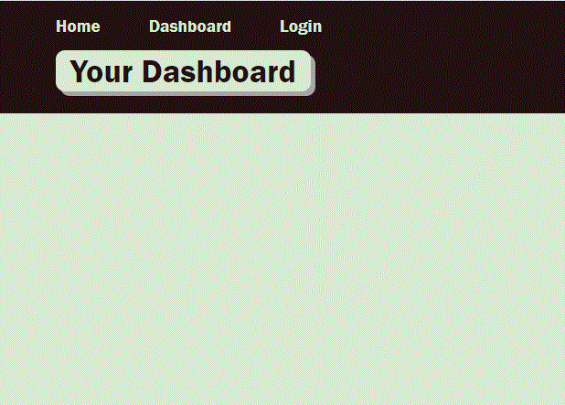

# Model-View-Controller (MVC): Tech Blog

Writing about tech can be just as important as making it. Developers spend plenty of time creating new applications and debugging existing codebases, but most developers also spend at least some of their time reading and writing about technical concepts, recent advancements, and new technologies. A simple Google search for any concept covered in this course returns thousands of think pieces and tutorials from developers of all skill levels!

This is a CMS-style blog site, where developers can publish their blog posts and comment on other developers’ posts as well. It is completely from scratch and deployed to .   

Followed the MVC paradigm in its architectural structure, using Handlebars.js as the templating language, Sequelize as the ORM, and the express-session npm package for authentication.

  
## Features

1. CMS-style blog site to  publish articles, blog posts, and my thoughts and opinions
2. the homepage, which includes existing blog posts if any have been posted; navigation links for the homepage and the dashboard; and the option to log in
3. clicking on the homepage option is taken to the homepage
4. Clicking on any other links in the navigation is prompted to either sign up or sign in
5. to sign up is prompted to create a username and password
6. clicking on the sign-up button, my user credentials are saved and I am logged into the site
7. revisit the site at a later time and choose to sign in is prompted to enter my username and password
8. signed in to the site can see navigation links for the homepage, the dashboard, and the option to log out
9. click on the homepage option in the navigation is taken to the homepage and presented with existing blog posts that include the post title and the date created
10. clicking on an existing blog post is presented with the post title, contents, post creator’s username, and date created for that post and have the option to leave a comment
11. entering a comment and clicking on the submit button while signed in, the comment is saved and the post is updated to display the comment, the comment creator’s username, and the date created
12. clicking on the dashboard option in the navigation is taken to the dashboard and presented with any blog posts I have already created and the option to add a new blog post
13. clicking on the button to add a new blog post is prompted to enter both a title and contents for my blog post
14. clicking on the button to create a new blog post, the title and contents of my post are saved and I am taken back to an updated dashboard with my new blog post
15. clicking on one of my existing posts in the dashboard is able to delete or update my post and taken back to an updated dashboard
16. clicking on the logout option in the navigation is signed out of the site
17. Being idle on the page for more than a set time is automatically signed out of the site 
18. reposited in Github and deployed in Heroku

## Portfolio

The following animation demonstrates the application functionality:

 

## Links

THe project structure is followed to Model-View-Controller paradigm using the [express-handlebars](https://www.npmjs.com/package/express-handlebars) package to implement Handlebars.js for the Views, use the [MySQL2](https://www.npmjs.com/package/mysql2) and [Sequelize](https://www.npmjs.com/package/sequelize) packages to connect to a MySQL database for the Models, and create an Express.js API for the Controllers.

It is [dotenv package](https://www.npmjs.com/package/dotenv) to use environment variables, the [bcrypt package](https://www.npmjs.com/package/bcrypt) to hash passwords, and the [express-session](https://www.npmjs.com/package/express-session) and [connect-session-sequelize](https://www.npmjs.com/package/connect-session-sequelize) packages to add authentication.

